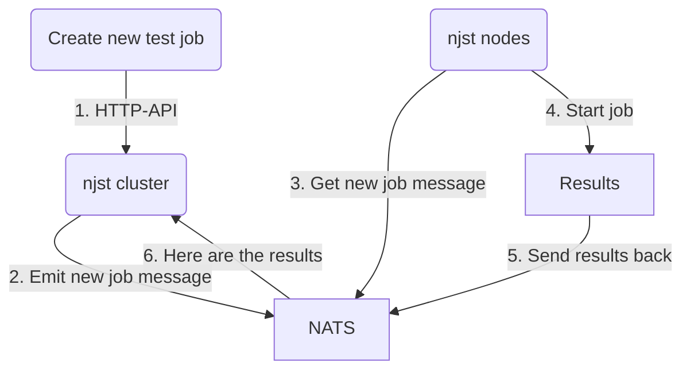

# njst

`njst` is a [NATS JetStream](https://docs.nats.io/nats-concepts/jetstream) 
_distributed_ benchmark and testing tool.

[Batch.sh](https://batch.sh) makes significant use of NATS JetStream and we use
this tool to run periodic benchmarks on our internal NATS JS clusters.

While `njst` supports read and write testing, it is primarily geared towards
testing reads with durable consumers.

**NOTE: While benchmarks are dumb, this will at least give you a _general_ idea 
about the performance capabilities of your NATS cluster.**

**NOTE 2: You might see some discrepancy in performance between `njst` and `nats bench`.
While slight deviation might be there due to `njst` missing some optimizations,
the results should be close. If they are not, ensure that you are passing `--pull`
to `nats bench` so that it uses durable pull consumers instead of ordered push
consumers (which are much faster but do not require ACKs).**

## Features

* Built *specifically* for testing JetStream
* Distributed by default
* No leader, no followers
* Cloud native - works best in k8s
* Simple [HTTP REST'ish API](./docs/api.md) for job control
* Ability to perform *massively parallel* tests to (attempt to) simulate real-world stress
* Uses _only_ durable pull consumers for reads
* Multi-consumer, multi-worker workloads with support for `FilterSubject`

## Usage

`njst` uses NATS internally to keep track of `njst` nodes and results. For this
reason, you will need to bring up a NATS instance in your env and point `njst`
node(s) to it via env vars or flags.

### Local

1. Bring up a NATS instance via docker-compose
   1. `docker-compose up -d`
2. Run 2 instances of `njst`
   1. Open terminal one: `go run main.go --debug --http-address=:5000`
   2. Open terminal two: `go run main.go --debug --http-address=:5001`
3. Verify that both `njst` nodes are in the cluster: 
   ```bash
      ❯ curl --request GET --url http://localhost:5000/bench/cluster
      {"nodes":["489e8fd7","6ebcb9bb"],"count":2}
   ```
4. Perform a test
   ```bash
   curl -X POST -L \
    --url http://localhost:5000/bench/ \
    --header 'Content-Type: application/json' \
    --data '{
       "description": "128",
       "nats": {
         "address": "127.0.0.1",
         "shared_connection": false
       },
       "write": {
         "num_nodes": 1,
         "num_streams": 1,
         "num_messages_per_stream": 1000,
         "num_workers_per_stream": 1,
         "msg_size_bytes": 24,
         "keep_streams": false,
         "batch_size": 100,
         "storage": "memory",
         "subjects": ["1", "2"]
       }
    }'
   {"id":"srOqCKmq","message":"benchmark created successfully; created 1 jobs"}
   ```
5. Grab the returned id and check its status
    ```bash
    ❯ curl -s http://localhost:5000/bench/srOqCKmq | jq
    {
      "status": {
        "status": "completed",
        "message": "benchmark completed; final",
        "job_id": "srOqCKmq",
        "elapsed_seconds": 0.05,
        "avg_msg_per_sec_per_node": 18142.89,
        "total_msg_per_sec_all_nodes": 18142.89,
        "total_processed": 1000,
        "total_errors": 0,
        "started_at": "2022-05-25T04:24:23.498141Z",
        "ended_at": "2022-05-25T04:24:23.553259Z"
      },
      "settings": {
        "description": "128",
        "nats": {
          "address": "127.0.0.1",
          "shared_connection": false
        },
        "write": {
          "num_streams": 1,
          "num_nodes": 1,
          "num_messages_per_stream": 1000,
          "num_workers_per_stream": 1,
          "subjects": [
            "1",
            "2"
          ],
          "num_replicas": 0,
          "batch_size": 100,
          "msg_size_bytes": 24,
          "keep_streams": false,
          "storage": "memory"
        },
        "id": "srOqCKmq"
      }
    }
    ```

### Production

1. Modify and use the following [k8s deploy config](./deploy.dev.yaml) to deploy
   3+ `nsjt` instance(s) to your kubernetes cluster.
    1. Update NATS env vars to point to your NATS cluster
    2. `kubectl apply -f deploy.dev.yaml`
2. Talk to any of the `njst` nodes via the [HTTP API](docs/api.md) to manage jobs

NOTE: To do anything useful with `njst`, you'll want to be able to talk to its API.
Since there's no service or ingres defined, you'll probably want to do a port-forward
to one of the pods via `kubectl`:
   * `kubectl port-forward njst-deployment-78d7b584cd-5sf9c 5000:5000`

## Why?

When evaluating a new technology such as a message bus/queue, in addition to
single node read/write performance, you'll probably want to also perform 
"real-world"-like tests to see how your cluster behaves.

NATS Jetstream is _amazing_ but aside from using `nats bench` to perform basic
read/write tests, we wanted to get insight into how our cluster will perform
under more realistic load (without updating all applications).

We created `njst` to do this. Maybe you'll find it useful too.

## You Should Know

`njst` is "dumb-distributed". Meaning, there are no concepts of leaders or
followers, there is no "election" and there is no consensus. 

In other words:

* When you submit a new job, the job will only be ran by the cluster members
that are currently connected to the cluster 
  * If new members join the cluster, they will have no idea about the pre-existing
  jobs.

* There is no auth - we have no need for it. If you want it, feel free to add it.

## Sample Jobs & Results

### Heavy Write Test

* This will cause 16 streams to be divided across 3 nodes
* Each stream will have 4 concurrent writers launched
* Each concurrent writer will write 25,000 messages to a stream
* Each message will contain 4096 random bytes (generated once at test creation time)
* `keep_streams" tells the test to NOT delete the generated streams and their contents
  * **We want this so that we can use the generated content for a future read test**
* Result: you will write 1,600,000 messages in total (16 streams x 100,000 messages)

```json
{
	"description": "heavy",
    "nats": {
        "address": "127.0.0.1",
        "connection_per_stream": false
    },
	"write": {
		"num_nodes": 3,
		"num_streams": 16,
		"num_messages_per_stream": 100000,
		"num_workers_per_stream": 4,
		"msg_size_bytes": 4096,
		"keep_streams": true
	}
}
```

### Heavy Read Test

* Spread reading from 16 streams across 3 nodes
  * 2 nodes will handle 5 streams, 1 node will handle 6 streams
* Each stream will be read by 4 concurrent workers
* Batching is *highly* important: each worker will read 1,000 messages at a time

```json
{
	"description": "heavy read test",
    "nats": {
        "address": "127.0.0.1",
        "connection_per_stream": false
    },
	"read": {
		"write_id": "i1mSzcm8", <--- write id from previous write test
		"num_nodes": 3,
		"num_streams": 16,
		"num_messages_per_stream": 100000,
		"num_workers_per_stream": 4,
		"batch_size": 1000
	}
}
```

### Results

**NOTE**: These are dummy output values. For our own benchmark results, see [docs/benchmarks.md](./docs/benchmarks.md).

```json
{
	"status": {
		"status": "completed",
		"message": "benchmark completed; final",
		"job_id": "dyczUnmQ",
		"node_id": "1efe113e",
		"elapsed_seconds": 245,
		"avg_msg_per_sec_per_node": 2176.67,
		"avg_msg_per_sec_all_nodes": 6530.61,
		"total_processed": 1600000,
		"total_errors": 0,
		"started_at": "2022-04-13T14:18:22.483853-07:00",
		"ended_at": "0001-01-01T00:00:00Z"
	},
	"settings": {
		"description": "medium read test with workermap",
        "nats": {
            "address": "127.0.0.1",
            "connection_per_stream": false
         },
		"read": {
			"write_id": "i1mSzcm8",
			"num_streams": 16,
			"num_nodes": 3,
			"num_messages_per_stream": 100000,
			"num_workers_per_stream": 4,
			"batch_size": 1000
		},
		"id": "dyczUnmQ"
	}
}
```


## Internal Flow

The general job flow can visualized via this confusing mermaid diagram:


 
1. Client talks to any `njst` node via HTTP API to create a new test job
2. `njst` node emits a new job message to the cluster (via NATS)
3. All `njst` nodes get the new job message
4. All `njst` nodes start the job
5. All `njst` nodes send their results back via NATS KV
6. All `njst` nodes listen for result completions in result KV and analyze the result
7. Any `njst` node can now respond to a "status" HTTP call for a specific job

## Our Benchmarks

You can read our benchmark results [here](./docs/benchmarks.md).
