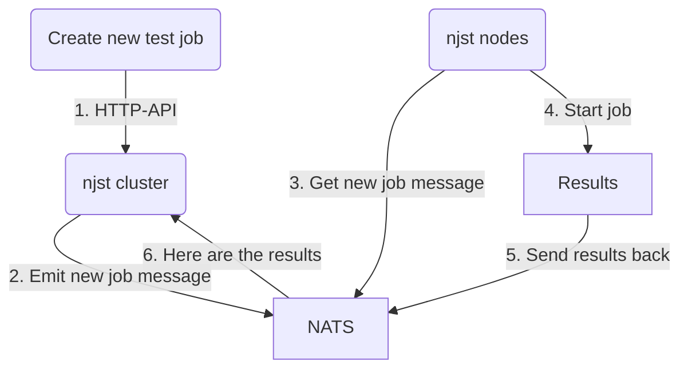

# njst

`njst` is a [NATS JetStream](https://docs.nats.io/nats-concepts/jetstream) 
_distributed_ benchmark and testing tool.

## Features

* Distributed by default
* No leader, no followers
* Cloud native - works best in k8s
* Simple HTTP REST'ish API for job control
* Ability to perform *massively parallel* tests to simulate real stress

## Why?

When evaluating a new technology such as a message bus/queue, in addition to
single node read/write performance, you'll probably want to perform a 
"real-world"-like test to see how your cluster behaves.

NATS Jetstream is _amazing_ but aside from using `ncli bench` to perform basic
read/write tests, we wanted to be extra sure that we know how NATS will perform
in production (without updating our entire stack).

## How?

1. Modify and use the following [k8s deploy config]() to deploy `nsjt` instance(s)
to your kubernetes cluster.
    1. `kubectl apply -f nsjt-deploy.yaml`
2. Talk to any of the `njst` nodes via the HTTP API to manage jobs

## You Should Know

`njst` is "dumb-distributed". Meaning, there are no concepts of leaders or
followers, there is no "election" and there is no consensus. 

In other words:

* When you submit a new job, the job will only be ran by the cluster members
that are currently connected to the cluster 
  * If new members join the cluster, they will have no idea about the pre-existing
  jobs.

* There is no auth - we have no need for it. If you want it, feel free to add it.

## Internal Flow

The general job flow can visualized via this confusing mermaid diagram:

 
1. Client talks to any `njst` node via HTTP API to create a new test job
2. `njst` node emits a new job message to the cluster (via NATS)
3. All `njst` nodes get the new job message
4. All `njst` nodes start the job
5. All `njst` nodes send their results back via NATS
6. All `njst` nodes listen for result completions and analyze the result
7. Any `njst` node can now respond to a "status" HTTP call for a specific job

